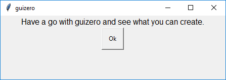

# About

### What is guizero?

guizero is a Python 3 library for creating simple GUIs. 

It is designed to allow new learners to quickly and easily create GUIs for their programs.



```python
from guizero import App, Text, PushButton

app = App(title="guizero")

intro = Text(app, text="Have a go with guizero and see what you can create.")
ok = PushButton(app, text="Ok")

app.display()
```

### Aims

The aim of guizero is to make the process of creating simple GUIs quick, accessible and understandable for new learners.

* Works with standard Python Tkinter GUI library (and no need to install other libraries)
* Abstracts away details new learners find difficult to understand (such as Tkinter StringVar() objects)
* Accessible widget naming system to help new learners to build up a mental model
* Flexible enough to be used for projects up to A-Level standard, yet accessible to primary school children
* Comprehensive and accessible documentation with examples
* Generates helpful additional error messages

### Version

guizero is currently [version 1.0.0](changelog.md)

