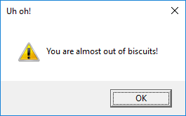
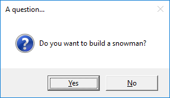
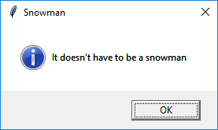
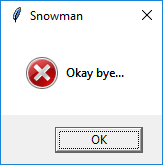

# Alerts

### Purpose
These functions pop up a box on the screen that displays a message. The functions available are:

* `warn(title, text)` - popup box with a warning icon
* `info(title, text)` - popup box with an information icon
* `error(title, text)` - popup box with an error icon
* `yesno(title, text)` - popup box with yes and no options. Pressing `Yes` returns `True` and pressing `No` returns `False`.

All pop up boxes use the native display, so they will look different depending on your operating system.

### Examples

**Warning box**

This will pop up a warning box with the title `"Uh oh!"` and the message `"You are almost out of biscuits!"`.

```python
app = App("Biscuit monitor")
warn("Uh oh!", "You are almost out of biscuits!")
app.display()
```
On Windows, the box looks like this:



The `info` and `error` boxes work in exactly the same way but will display different icons.

**Yes/No box**

When this function is called it returns a **boolean** value.

* If `Yes` was pressed, return `True`
* If `No` was pressed, return `False`

You can store this value in a variable and test it:

```python
app = App("Snowman")
build_a_snowman = yesno("A question...", "Do you want to build a snowman?")
if build_a_snowman == True:
    info("Snowman", "It doesn't have to be a snowman")
else:
    error("Snowman", "Okay bye...")
app.display()
```

This code will first display the yes/no box



If `Yes` is pressed, an information box will be displayed:



If `No` is pressed, an error box will be displayed



**Using functions as a callback**

You can also use these functions in a *callback* (when you have to provide a function for another widget to call). Here is an example with a `PushButton` which pops up an `info` box when it is pressed.

```python
app = App()
button = PushButton(app, info, ["Info", "You pressed the button"])
app.display()
```

The arguments provided to the `PushButton` are:

* Where the button should be created (within the `app`)
* The name of the function to call when pressed (`info`)
* A list of the arguments to the function you are calling (values for the `title` and `message` arguments for the `info` function)
