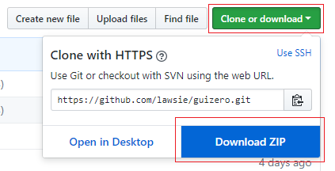
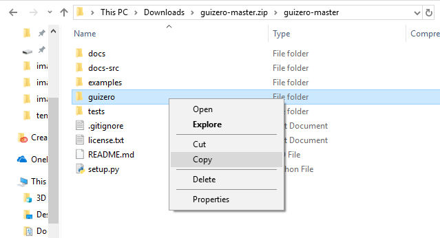

# Installation

guizero is designed to allow children to quickly and easily create GUIs for their programs.

If you can download and unzip a file, you can [install guizero](#easy-installation) - **no special permissions or administrator rights are required**.

If you have administrator rights and are connected to the internet, you can use [pip to quickly install guizero](#install-using-pip).

guizero only requires `tkinter` to be installed, which is included with a standard Python installation on all platforms except Linux.

## Easy installation

1. Go to the [Github repo](https://github.com/lawsie/guizero) for guizero

2. Click the green "Clone or download" button and then "Download ZIP"

    

3. Unzip the file

4. Open the `guizero-master` folder, then copy the `guizero` folder and paste it into your home directory

    

5. That's it! When you write your guizero code, make sure you save it into your home directory.

## Install using pip

### Windows

1. Make sure you have [pip](https://projects.raspberrypi.org/en/projects/using-pip-on-windows) installed.
2. Open a command prompt
3. Type `pip install guizero` and press Enter

## Raspberry Pi

1. Open a terminal window
2. Type `sudo pip3 install guizero` and press Enter

## Mac OS
1. Open a terminal (you can search for it in the Launch Pad)

    

2. Type `sudo pip3 install guizero`

    

## Linux

1. Open a terminal
2. Install `tkinter` using your distribution's package manager, e.g. `sudo apt install python3-tk`
3. Install guizero using pip by typing `pip3 install guizero` or `sudo pip3 install guizero` if you dont have superuser rights
