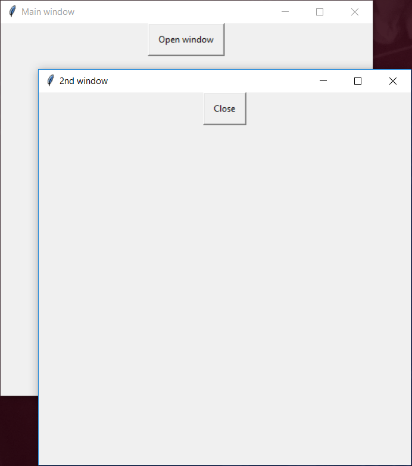

# Window

(Contains a `tkinter.TopLevel` object)

`__init__(self, master, title="guizero", width=500, height=500, layout="auto", bg=None, visible=True):`

### What is it?
A `Window` object is how you create new windows in guizero.



### How do I make one?

Create an `Window` object like this:

```python
from guizero import App, Window
app = App()
window = Window(app)
app.display()
```

### Starting parameters

When you create a `Window` object you **must** specify a `master` and you can specify any of the the optional parameters. Specify parameters in the brackets like this: `window = Window(app, bg="red", height=200)`

| Parameter | Data type          | Default   | Compulsory | Description                                                                                   |
|-----------|--------------------|-----------|------------|-----------------------------------------------------------------------------------------------|
| master    | App                | -         | Yes        | The app to which the window belongs                                                           |
| bg        | [color](colors.md) | None      | No         | The background colour of the window. Takes a [color](colors.md) value.                        |
| height    | int                | 500       | No         | The height of the window in pixels.                                                           |
| layout    | string             | "auto"    | No         | Whether widgets pack themselves (`"auto"`) or you specify their position on a grid (`"grid"`) |
| title     | string             | "guizero" | No         | The title displayed in the bar at the top of the window.                                      |
| width     | int                | 500       | No         | The width of the window in pixels.                                                            |
| visible   | boolean            | True      | No         | If the window should be visible.                                                              |

### Methods

You can call the following methods on a `Window` object.

| Method                | Takes                               | Returns | Description                                                                                                                                                    |
|-----------------------|-------------------------------------|---------|----------------------------------------------------------------------------------------------------------------------------------------------------------------|
| after(time, command)  | time (int), command (function name) | -       | Schedules a **single** call to `command` after `time` milliseconds. (To repeatedly call the same command, use `repeat()`)                                      |
| cancel(command)       | command (function name)             | -       | Cancels a scheduled call to `command`                                                                                                                          |
| disable()             | -                                   | -       | Disables all the widgets in the window so that they cannot be interacted with                                                                                  |
| destroy()             | -                                   | -       | Destroys the windows                                                                                                                                           |
| enable()              | -                                   | -       | Enables all the widgets in the window                                                                                                                          |
| focus()               | -                                   | -       | Gives focus to the window                                                                                                                                      |
| hide()                | -                                   | -       | Hides the window from view.                                                                                                                                    |
| on_close(command)     | command (function name)             | -       | Calls the given function when the user tries to close the window.                                                                                              |
| repeat(time, command) | time (int), command (function name) | -       | Repeats `command` every `time` milliseconds. This is useful for scheduling a function to be regularly called, for example updating a value read from a sensor. |
| show(wait = False)    | -                                   | -       | Displays the window if it was previously hidden                                                                                                                |
| update()              | -                                   | -       | Force the window to update itself, useful if changes aren't reflected in the UI.                                                                               |

### Properties

You can set and get the following properties:

| Method     | Data type          | Description                                                  |
|------------|--------------------|--------------------------------------------------------------|
| bg         | [color](colors.md) | The background colour of the window                          |
| enabled    | boolean            | `True` if the window is enabled                              |
| font       | string             | The font that widgets should use                             |
| height     | int                | The height of the window                                     |
| layout     | string             | The layout being used by the Window (`"auto"`) or (`"grid"`) |
| title      | string             | The title of the window                                      |
| text_size  | int                | The size of the text widgets should use                      |
| text_color | [color](colors.md) | The colour of the text widgets should use                    |
| visible    | boolean            | If the window is visible                                     |
| width      | int                | The width of the window                                      |


Refer to a property as `<name of widget>.property`. For example, if your `Window` object is called `window` you would write `window.title`.

You can **set** the property (for example `window.title = "Hello world"`) or **get** the value of the property to use (for example `print(window.title)`).

### Examples

**Creating a Window object**

Create an `Window` object by calling the `Window()` constructor. You should give the object a name so you can refer to it later - in this case we have called it `window`. It is best to keep the name you give to your `Window` object quite short, as you will have to use it to tell other widgets where they should be stored.


```python
from guizero import App, Window
app = App(title="My app", height=300, width=200)
window = Window(title = "2nd Window", height=300, width=200)
app.display()
```

**Showing and hiding a Window**

`Window` objects can be shown and hidden using the `show()` and `hide()` methods:

```python
from guizero import App, Window, PushButton

def open_window():
    window_2.show()

app = App(title="My app", height=300, width=200)
window = Window(app, title = "2nd Window", height=300, width=200)
window.hide()

open_button(app, text="open 2nd window", command=open_window)

app.display()
```

If you want a `Window` to become the main window and stop all other windows responding until it is closed you can set the optional `wait` parameter to `True` when using `show`:

```python
def open_window():
    window_2.show(wait = True)
```

